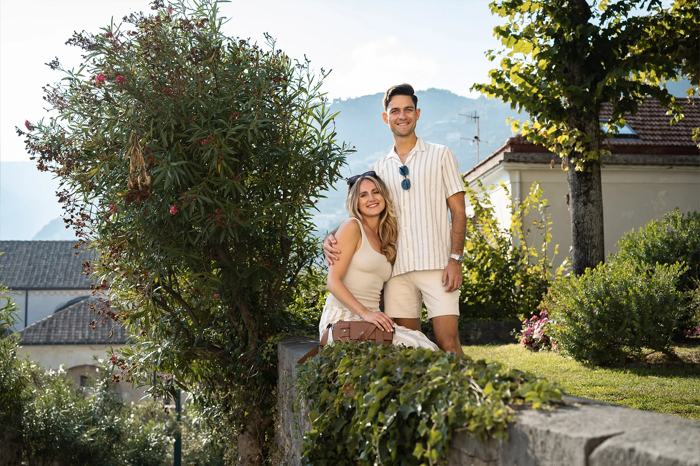
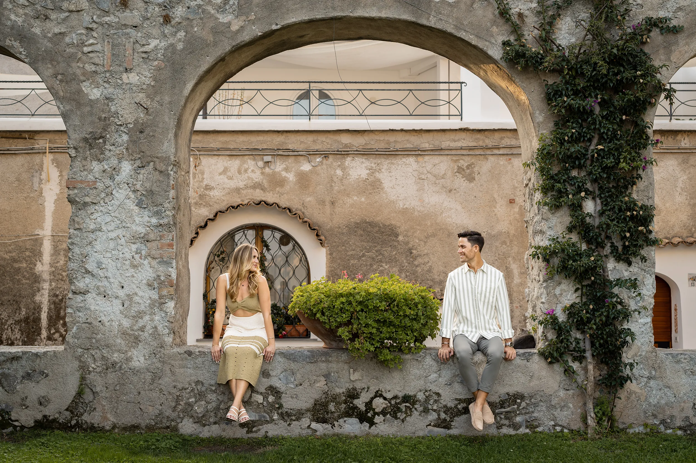

# Capturing Love: Ravello Romance Photoshoot with Taylor and Regan

*Gorgeous Couple Engagement Amalfi Coast Photoshoot in Ravello*

> Enchanting engagement photoshoot in Ravello. A romantic Amalfi Coast photoshoot with historic villas, and the stunning panoramas of Italy.

---

## A Timeless Romance in Ravello

In the embrace of Ravello's captivating scenery on the illustrious Amalfi Coast, a tale of love and commitment was beautifully captured in frames of everlasting memories. Taylor and Regan, a couple radiant with love, chose this enchanting setting to celebrate and capture their engagement, a sweet beginning marked by Regan's heartfelt proposal to Taylor.

---

## Crafting Visual Love Stories by a Skilled Photographer

Guided by the adept hands of a skilled photographer, their love story was meticulously painted in each snapshot, turning moments into timeless treasures. The photographer, a maestro in leveraging natural light and scenery, wielded the camera with an artful touch, turning each moment, each glance, each smile, into a lovingly captured memory.

Navigating through the woven paths flanked by lush gardens and historical villas, each photograph resonated with the natural romance of Ravello and the Amalfi Coast, turning the picturesque scenery into a canvas that mirrored their love and happiness.

---

## The Amalfi Allure: A Canvas of Romance

The sun, a golden artist in the October sky, bathed Taylor and Regan in warm, glowing hues, providing a natural illumination that heightened the romance and tenderness captured in each frame. The radiant sunshine complemented the outdoor beauty, making every color pop and every moment shine in the labyrinth of Ravello's charm.

---

## The Most Cherished Moments

*The most cherished moments in life deserve to be eternally remembered. These fleeting instances are crafted once, leaving an indelible mark that never fades away…*

One small detail: Overflowing with a delightful assortment of photos, Taylor and Regan's heart was set on turning these visual memories into a beautiful book — a cherished collection that tells the tale of their love amidst the enchanting allure of Ravello's romantic landscape. The couple's journey, marked by these visually arresting images, became a symphony of love, each photograph a note, a memory, a beautiful moment in their amorous melody.

---

## Photo Gallery

---

*Capture memories that will last a lifetime!*

**Original URL:** https://amalfi.day/2023/10/05/regan-tay-ravello/
**Category:** Couple
