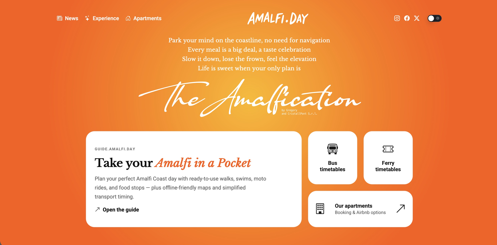

# Amalfi.Day — CristallPont Amalfi Day

Сайт-экосистема для Amalfi Coast: фотосессии, апартаменты, маршруты и локальные советы. Проект построен на Astro, собирается в статический сайт и использует Ghost API для новостей/блога.



## Что внутри

- Статические страницы и шаблоны (Astro)
- Галереи и истории фотосессий
- Раздел апартаментов и карточки объектов
- Страница блога с данными из Ghost
- Глобальные SEO/OG/Twitter meta + социальные превью
- Сборка `static` с предсжатием ассетов

## Стек

- Astro 5
- MDX (Astro integration)
- Bootstrap Icons
- Node.js

## Как все работает

1. **Astro** рендерит страницы из `src/pages` и компонентов `src/components`.
2. **BaseLayout** (`src/layouts/BaseLayout.astro`) задает общую разметку и SEO/OG/Twitter мета‑теги.
3. **Контент** страниц хранится прямо в `.astro` файлах.
4. **Блог** подтягивает посты из Ghost через `src/data/ghost.ts`. Если переменные окружения не настроены, блог просто показывает пустой список.
5. **Статические изображения** лежат в `public/` и `staticpages/`.
6. **Сборка** — статическая (`output: 'static'` в `astro.config.mjs`).

## Быстрый старт

```bash
npm install
npm run dev
```

Откройте `http://localhost:4321`.

## Переменные окружения

Скопируйте `.env.example` в `.env` и заполните значения:

```bash
TELEGRAM_BOT_TOKEN=...
TELEGRAM_CHAT_ID=...
PUBLIC_WHATSAPP_PHONE=...
GHOST_API_URL=https://day.cristallpont.com/blog
GHOST_CONTENT_API_KEY=...
```

`GHOST_API_URL` и `GHOST_CONTENT_API_KEY` нужны для загрузки блога.

## Скрипты

- `npm run dev` — локальная разработка
- `npm run build` — сборка Astro
- `npm run build:static` — сборка + предсжатие ассетов
- `npm run preview` — локальный preview сборки
- `npm run update-calendars` — обновление календарей (если используется)
- `npm run optimize-images` — оптимизация изображений

## Структура проекта

- `src/pages` — страницы сайта
- `src/layouts` — базовые шаблоны
- `src/components` — компоненты интерфейса
- `src/data` — данные и интеграции (например Ghost)
- `public` — публичные ассеты (доступны по `/...`)
- `staticpages` — большие изображения и медиа для страниц
- `scripts` — утилиты для сборки/оптимизации

## SEO и социальные превью

Каждая страница задает:
- `title`, `description`
- `og:*` и `twitter:*` мета‑теги
- `canonical`
- превью‑картинку страницы

Глобальные значения и дефолтные картинки заданы в `src/data/site.ts`.

## Деплой

Проект рассчитан на статический хостинг (Vercel, Netlify, Cloudflare Pages или любой S3‑подобный CDN). Сборка: `npm run build:static`.

## Контент

- Фотосессии: `src/pages/photoshootings/*`
- Апартаменты: `src/pages/apartments.astro`
- Блог: `src/pages/blog/index.astro`
- Списки/навигация: `src/data/site.ts`

## Обратная связь

Если нужно расширить страницы или добавить новый раздел — проще всего скопировать существующий `.astro` файл и заменить контент/изображения.
