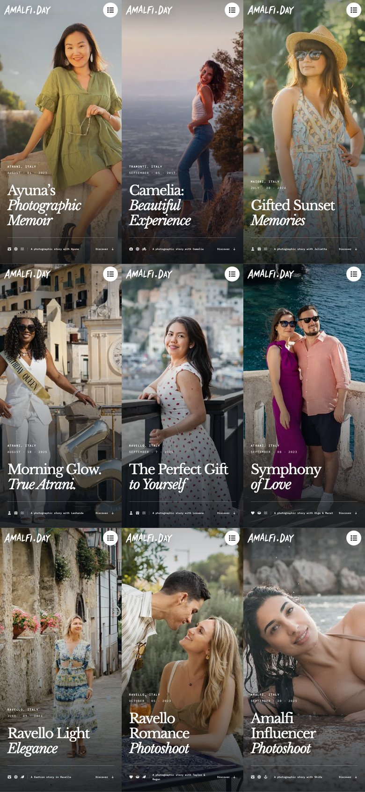

# Photoshoots production checkpoint — 29 September 2026

Rollback tag: `rollback/photoshoots-production-2026-09-29`.
This tag preserves the published gallery migration, including all optimized
photographs and the removal of Colours of Atrani.

## Published content

- Nine photoshoots share the approved page template: 27 galleries and 108
  photographs, without repeated frames between chapters of the same shoot.
- Original photographs, covers, English copy, dates, canonical URLs and
  structured data are preserved. Normal photoshoot pages remain indexable.
- 448 WebP variants cover 112 distinct originals, including separate covers.
  Dimensions and proportions are preserved; small originals are not enlarged.
- `template-gallery` retains its four gallery variants and its noindex setting.
- Colours of Atrani is absent from the catalogue, source routes and sitemap.
  Its former URLs return HTTP 404 through the production Caddy rule documented
  in [the deployment guide](../deploy-static.md). Shared photographs remain.

## Verification

Image preparation, the local build and the production static build succeeded.
The final production build contains 146 pages with Brotli/Gzip assets.

All 108 photographs and nine covers were visually checked at 320×568, 390×844,
768×1024, 1440×900 and 844×390, including cover animation endpoints and both
themes. Checks covered gallery counts, thumbnails, odd spreads, dragging,
emulated touch, vertical scrolling, the fullscreen viewer, Escape and focus
return. Form success, validation, failures and duplicate submission guards were
tested with intercepted responses; no real enquiries were sent. Checks used
Chromium, not physical phones or other browser engines.

After publication, all nine public pages returned HTTP 200 and the expected
gallery/photo counts. Browser checks confirmed images, gallery navigation,
the viewer and the form opening without JavaScript errors. The removed page
returned HTTP 404. The contact API, rebuild service and Caddy remained active.

[Public HTTP check results](photoshoots-2026-09-29-http.json).

## Restore this checkpoint

Fetch the tag and create a separate checkout at
`rollback/photoshoots-production-2026-09-29`. Install the locked dependencies,
provide the existing server environment privately and use `npm run build:static`.
Preserve the server's public domain-verification files. Calendar data and blog
content are refreshed during the build, so a rebuilt site can differ from the
original release in those live integrations.

Verify the new output before replacing `/srv/amalfiday/dist`; retain the current
output for rollback. Keep the Caddy removal rule from the deployment guide.
Avoid resetting or building directly over a running production release.

The pre-migration production output, changed source files and Caddy configuration
are additionally retained on the VPS in
`/srv/amalfiday/.deploy-backups/photoshoots-20260929-111447/`. That backup is the
version **before** this checkpoint. The Git tag represents the updated version.

The Git checkpoint does not include local browser logs, generated test screenshots,
unpublished photo collections, private runtime configuration or VPS-only backups.
